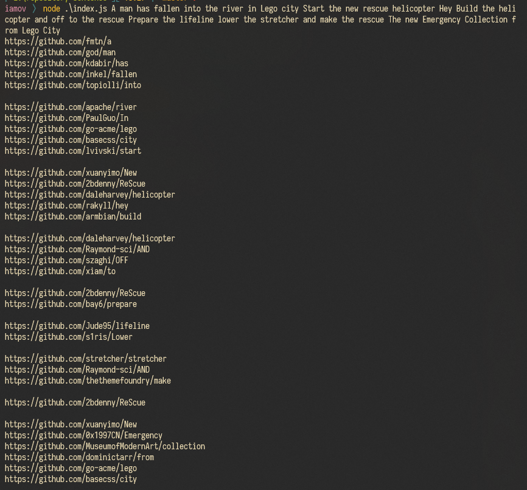

# repository-sentence

> Generate a list of GitHub repository URLs based on words given in the terminal!



It started with a stupid idea I had after someone pasted the [LEGO City copypasta](https://www.google.com/search?client=firefox-b-d&q=lego+city+copypasta) on a Discord I'm in. 🤷‍♀️

## Usage

Clone or otherwise download the repository, and then [generate a new personal access token for GitHub](https://github.com/settings/tokens/new).
No scopes are needed to access the search API, so just scroll down and click `Generate token`.

Put this token in a `token.json` in this repo with the following structure:

```json
{
  "token": "<access token>"
}
```

And then run the following commands:

```bash
yarn # or `npm install`
node ./index.js <text> # or `yarn start <text>` if you really want to.
```

That's about it.  
PR for changes if you want, I might take a look at them. Or just fork your own thing.

A star is appreciated however.

## TODO

- Probably batch all the queries together so that only one request is needed.

## License

This code is released under the Unlicense, do whatever you want with it.
For more info, read [LICENSE](./LICENSE)
